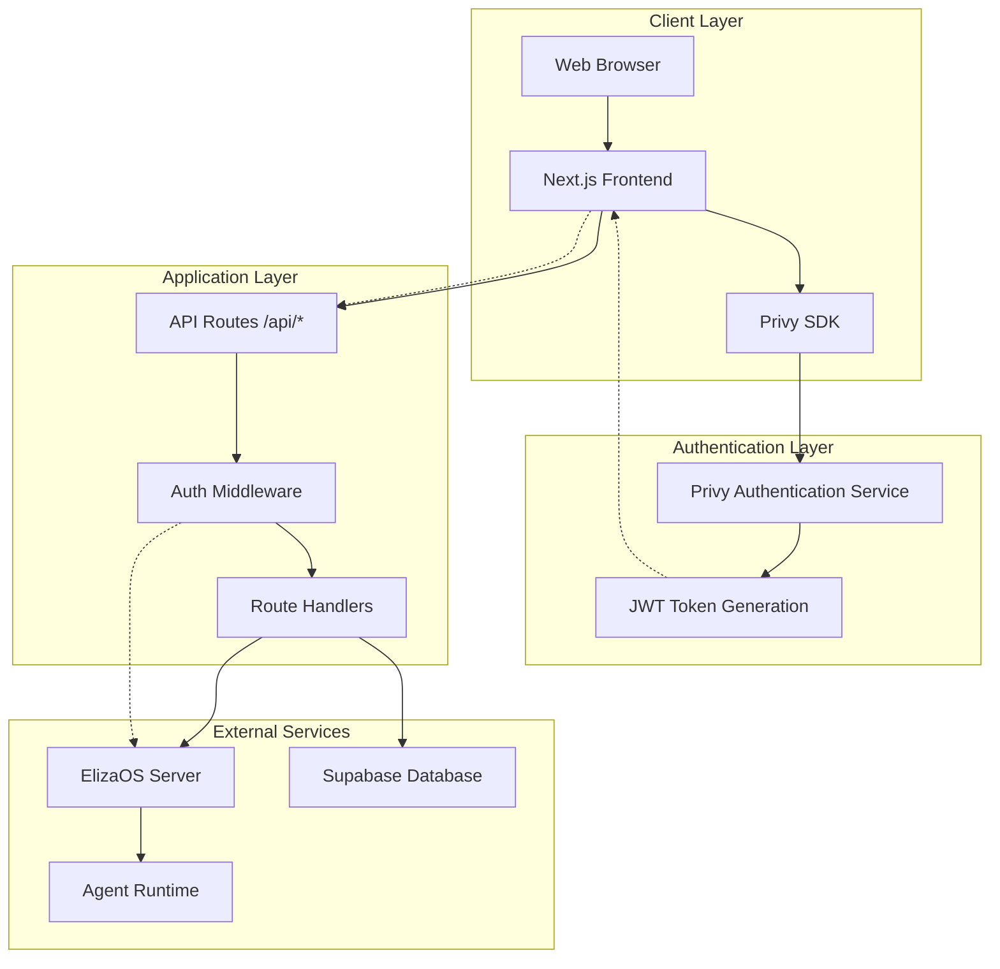

# Privy JWT Security Architecture Plan

## Overview

This document outlines a comprehensive theoretical plan for implementing secure Privy JWT authentication across frontend and backend systems, with specific focus on ElizaOS integration and user data protection.

## Table of Contents

1. [Authentication Flow Architecture](#authentication-flow-architecture)
2. [Frontend Security Model](#frontend-security-model)
3. [Backend Security Model](#backend-security-model)
4. [ElizaOS Integration Security](#elizaos-integration-security)
5. [Token Management Strategy](#token-management-strategy)
6. [Security Layers & Defense](#security-layers--defense)
7. [Threat Model & Mitigations](#threat-model--mitigations)
8. [Implementation Phases](#implementation-phases)

---

## Authentication Flow Architecture

### High-Level Authentication Diagram



### Token Flow Sequence

```
┌─────────┐    ┌──────────┐    ┌─────────────┐    ┌──────────────┐    ┌─────────────┐
│ Browser │    │ Frontend │    │ Privy Auth  │    │ API Gateway  │    │ ElizaOS     │
└─────────┘    └──────────┘    └─────────────┘    └──────────────┘    └─────────────┘
     │              │                │                    │                    │
     │──── Login ───▶│                │                    │                    │
     │              │─── Authenticate ──▶│                 │                    │
     │              │◀─── JWT Token ─────│                 │                    │
     │◀─── Store ───│                │                    │                    │
     │              │                │                    │                    │
     │─── API Call ─▶│                │                    │                    │
     │              │─── Request + JWT ────────────────────▶│                    │
     │              │                │                    │─── Validate JWT ───│
     │              │                │                    │◀─── User Context ──│
     │              │                │                    │─── Forward Request ─▶│
     │              │◀─── Response ─────────────────────────│◀─── Response ──────│
     │◀─── Result ──│                │                    │                    │
```

---

## Frontend Security Model

### 1. Authentication State Management

#### Secure Token Storage Strategy
```
Storage Options Evaluation:
┌──────────────────┬──────────────┬────────────────┬─────────────────┐
│ Storage Method   │ Security     │ Persistence    │ Recommendation  │
├──────────────────┼──────────────┼────────────────┼─────────────────┤
│ localStorage     │ ⚠️  Medium    │ ✅ Persistent   │ ❌ Not Secure   │
│ sessionStorage   │ ⚠️  Medium    │ ❌ Session     │ ⚠️  Temporary   │
│ httpOnly Cookie  │ ✅ High      │ ✅ Persistent   │ ✅ Recommended  │
│ Memory Only      │ ✅ Highest   │ ❌ Session     │ ✅ Most Secure  │
│ Secure Context   │ ✅ High      │ ⚠️  Variable   │ ✅ Hybrid       │
└──────────────────┴──────────────┴────────────────┴─────────────────┘
```

#### Token Lifecycle Management
```
Token States:
┌─────────────┐    ┌─────────────┐    ┌─────────────┐    ┌─────────────┐
│  OBTAINED   │───▶│   ACTIVE    │───▶│  REFRESHING │───▶│  EXPIRED    │
└─────────────┘    └─────────────┘    └─────────────┘    └─────────────┘
       │                  │                  │                  │
       │                  │                  │                  ▼
       │                  │                  │            ┌─────────────┐
       │                  │                  │            │  REVOKED    │
       │                  │                  │            └─────────────┘
       │                  │                  │                  │
       ▼                  ▼                  ▼                  ▼
 ┌─────────────────────────────────────────────────────────────────────┐
 │                        CLEANUP & LOGOUT                            │
 └─────────────────────────────────────────────────────────────────────┘
```

### 2. Request Authentication

#### Authenticated Fetch Wrapper
```
Request Pipeline:
User Action → AuthenticatedFetch → Token Validation → API Call → Response

Validation Steps:
1. Check token existence
2. Verify token expiry
3. Refresh if needed
4. Attach to request
5. Handle auth errors
6. Retry with new token
```

### 3. Client-Side Security Measures

```
Security Controls:
├── Content Security Policy (CSP)
├── Subresource Integrity (SRI)
├── HTTPS Enforcement
├── XSS Protection Headers
├── Token Expiry Handling
├── Automatic Logout on Idle
├── Secure Cookie Settings
└── CSRF Token Validation
```

---

## Backend Security Model

### 1. Authentication Middleware Architecture

```
Request Flow Through Security Layers:

┌─────────────────┐
│ Incoming Request│
└─────────┬───────┘
          │
          ▼
┌─────────────────┐
│ CORS Validation │
└─────────┬───────┘
          │
          ▼
┌─────────────────┐
│ Origin Check    │
└─────────┬───────┘
          │
          ▼
┌─────────────────┐
│ Rate Limiting   │
└─────────┬───────┘
          │
          ▼
┌─────────────────┐
│ JWT Validation  │
└─────────┬───────┘
          │
          ▼
┌─────────────────┐
│ User Context    │
└─────────┬───────┘
          │
          ▼
┌─────────────────┐
│ Permission Check│
└─────────┬───────┘
          │
          ▼
┌─────────────────┐
│ Route Handler   │
└─────────────────┘
```

### 2. Multi-Layer Authentication Strategy

#### Layer 1: Transport Security
```
Transport Layer Protection:
├── HTTPS/TLS Encryption
├── Certificate Pinning
├── HSTS Headers
├── Secure Cookie Flags
└── Perfect Forward Secrecy
```

#### Layer 2: Request Validation
```
Request Validation Pipeline:
├── Content-Type Validation
├── Payload Size Limits
├── Input Sanitization
├── SQL Injection Prevention
├── XSS Attack Prevention
└── Command Injection Prevention
```

#### Layer 3: Authorization Matrix
```
Permission Model:
┌──────────────┬─────────┬─────────┬─────────┬─────────┐
│ Resource     │ Owner   │ Admin   │ User    │ Guest   │
├──────────────┼─────────┼─────────┼─────────┼─────────┤
│ Own Profile  │ CRUD    │ CRUD    │ R       │ -       │
│ Own Sessions │ CRUD    │ CRUD    │ -       │ -       │
│ Own Messages │ CRUD    │ CRUD    │ -       │ -       │
│ Agent Data   │ R       │ CRUD    │ R       │ -       │
│ System Info  │ -       │ R       │ -       │ -       │
└──────────────┴─────────┴─────────┴─────────┴─────────┘
```

### 3. Token Validation Process

```
JWT Validation Algorithm:

1. Extract Token from Header
   ├── Authorization: Bearer <token>
   └── Fallback: Cookie extraction

2. Structural Validation
   ├── Check JWT format (header.payload.signature)
   ├── Decode header and payload
   └── Validate required claims

3. Cryptographic Verification
   ├── Fetch Privy public key
   ├── Verify signature
   └── Check algorithm match

4. Claims Validation
   ├── exp (expiration time)
   ├── iat (issued at time)
   ├── iss (issuer verification)
   ├── aud (audience verification)
   └── sub (subject validation)

5. User Context Resolution
   ├── Extract user ID
   ├── Load user permissions
   ├── Create auth context
   └── Attach to request
```

---

## ElizaOS Integration Security

### 1. Secure Proxy Architecture

```
API Proxy Security Model:

┌─────────────────┐    ┌─────────────────┐    ┌─────────────────┐
│   Next.js API   │───▶│  Auth Proxy     │───▶│  ElizaOS Server │
│   Routes        │    │  Middleware     │    │                 │
└─────────────────┘    └─────────────────┘    └─────────────────┘
         │                       │                       │
         │                       │                       │
    ┌────▼────┐             ┌────▼────┐             ┌────▼────┐
    │ Client  │             │ Server  │             │ Agent   │
    │ Auth    │             │ Auth    │             │ Runtime │
    │ Token   │             │ Token   │             │ Context │
    └─────────┘             └─────────┘             └─────────┘
```

### 2. Token Forwarding Strategy

```
Token Flow to ElizaOS:

Frontend Token ──┐
                 │
                 ▼
         ┌─────────────────┐
         │ API Middleware  │
         │ - Validate JWT  │
         │ - Extract User  │
         │ - Create Context│
         └─────────┬───────┘
                   │
                   ▼
         ┌─────────────────┐
         │ ElizaOS Headers │
         │ - Authorization │
         │ - X-User-ID     │
         │ - X-User-Email  │
         │ - X-User-Perms  │
         └─────────┬───────┘
                   │
                   ▼
         ┌─────────────────┐
         │ ElizaOS Server  │
         │ - Verify Token  │
         │ - Process Request│
         │ - Return Response│
         └─────────────────┘
```

### 3. Agent-User Context Mapping

```
User-Agent Security Mapping:

┌────────────────┬─────────────────┬──────────────────┬─────────────────┐
│ User Context   │ Agent Access    │ Channel Rights   │ Data Isolation  │
├────────────────┼─────────────────┼──────────────────┼─────────────────┤
│ User A         │ Agent 1,2,3     │ Channels A1-A5   │ Isolated        │
│ User B         │ Agent 2,4       │ Channels B1-B3   │ Isolated        │
│ Admin          │ All Agents      │ All Channels     │ Global Access   │
│ Guest          │ Public Agents   │ Public Channels  │ Read-Only       │
└────────────────┴─────────────────┴──────────────────┴─────────────────┘
```

---

## Token Management Strategy

### 1. Token Lifecycle

```
Token Management Workflow:

┌─────────────┐    ┌─────────────┐    ┌─────────────┐
│  GENERATE   │───▶│   ISSUE     │───▶│   STORE     │
└─────────────┘    └─────────────┘    └─────────────┘
       │                  │                  │
       │                  │                  ▼
       │                  │            ┌─────────────┐
       │                  │            │   VERIFY    │
       │                  │            └─────────────┘
       │                  │                  │
       │                  │                  ▼
       │                  │            ┌─────────────┐
       │                  │            │   REFRESH   │
       │                  │            └─────────────┘
       │                  │                  │
       ▼                  ▼                  ▼
┌─────────────────────────────────────────────────────┐
│              REVOKE & CLEANUP                       │
└─────────────────────────────────────────────────────┘
```

### 2. Refresh Strategy

```
Token Refresh Algorithm:

┌─────────────────────────────────────────────────────┐
│ Token Expiry Check (Before Each Request)           │
├─────────────────────────────────────────────────────┤
│                                                     │
│ Current Time vs Token Expiry                       │
│ ├── > 5 minutes remaining: Use current token       │
│ ├── 1-5 minutes remaining: Refresh proactively     │
│ ├── < 1 minute remaining: Refresh immediately      │
│ └── Expired: Force re-authentication               │
│                                                     │
└─────────────────────────────────────────────────────┘

Refresh Process:
1. Detect approaching expiry
2. Request new token from Privy
3. Update stored token atomically
4. Retry original request
5. Handle refresh failures gracefully
```

### 3. Security Events & Monitoring

```
Security Event Types:
├── Authentication Events
│   ├── Login Success/Failure
│   ├── Token Issued/Renewed
│   ├── Token Expired/Revoked
│   └── Logout Events
├── Authorization Events
│   ├── Permission Granted/Denied
│   ├── Resource Access Attempts
│   ├── Privilege Escalation Attempts
│   └── Cross-User Data Access
└── Security Violations
    ├── Invalid Token Usage
    ├── Rate Limit Exceeded
    ├── Suspicious Activity Patterns
    └── Attack Attempts
```

---

## Security Layers & Defense

### 1. Defense in Depth Strategy

```
Security Layer Stack:

┌─────────────────────────────────────────────────────┐
│ Layer 7: Application Logic Security                │
│ - Business Logic Validation                        │
│ - Data Access Controls                             │
│ - User Permission Enforcement                      │
└─────────────────────────────────────────────────────┘
┌─────────────────────────────────────────────────────┐
│ Layer 6: Authentication & Authorization            │
│ - JWT Validation                                   │
│ - User Context Resolution                          │
│ - Permission Checking                              │
└─────────────────────────────────────────────────────┘
┌─────────────────────────────────────────────────────┐
│ Layer 5: API Security                              │
│ - Rate Limiting                                    │
│ - Input Validation                                 │
│ - Output Sanitization                              │
└─────────────────────────────────────────────────────┘
┌─────────────────────────────────────────────────────┐
│ Layer 4: Session Management                        │
│ - Token Lifecycle                                  │
│ - Session Timeout                                  │
│ - Concurrent Session Control                       │
└─────────────────────────────────────────────────────┘
┌─────────────────────────────────────────────────────┐
│ Layer 3: Transport Security                        │
│ - HTTPS/TLS                                        │
│ - Certificate Validation                           │
│ - Perfect Forward Secrecy                          │
└─────────────────────────────────────────────────────┘
┌─────────────────────────────────────────────────────┐
│ Layer 2: Network Security                          │
│ - CORS Policy                                      │
│ - CSP Headers                                      │
│ - Firewall Rules                                   │
└─────────────────────────────────────────────────────┘
┌─────────────────────────────────────────────────────┐
│ Layer 1: Infrastructure Security                   │
│ - Server Hardening                                 │
│ - Access Controls                                  │
│ - Monitoring & Logging                             │
└─────────────────────────────────────────────────────┘
```

### 2. Security Controls Matrix

```
┌──────────────────┬────────────┬─────────────┬─────────────┬─────────────┐
│ Security Control │ Frontend   │ API Layer   │ ElizaOS     │ Database    │
├──────────────────┼────────────┼─────────────┼─────────────┼─────────────┤
│ Authentication   │ Privy SDK  │ JWT Verify  │ Token Fwd   │ User Lookup │
│ Authorization    │ UI Guards  │ Permissions │ Context     │ RLS Policies│
│ Input Validation │ Client Val │ Sanitization│ Agent Val   │ Constraints │
│ Rate Limiting    │ UI Limits  │ Middleware  │ Agent Limit │ Query Limit │
│ Encryption       │ HTTPS      │ TLS         │ TLS         │ At-Rest     │
│ Monitoring       │ Error Log  │ Access Log  │ Agent Log   │ Audit Log   │
│ Data Protection  │ PII Mask   │ Sanitize    │ Context Iso │ Encryption  │
└──────────────────┴────────────┴─────────────┴─────────────┴─────────────┘
```

---

## Threat Model & Mitigations

### 1. Identified Threats

#### High Priority Threats
```
┌─────────────────────┬─────────────────┬─────────────────┬─────────────────┐
│ Threat              │ Impact          │ Likelihood      │ Mitigation      │
├─────────────────────┼─────────────────┼─────────────────┼─────────────────┤
│ Token Theft         │ HIGH            │ MEDIUM          │ Short Expiry    │
│ Session Hijacking   │ HIGH            │ LOW             │ HTTPS + SameSite│
│ CSRF Attacks        │ MEDIUM          │ MEDIUM          │ CSRF Tokens     │
│ XSS Attacks         │ HIGH            │ LOW             │ CSP + Sanitize  │
│ Data Exfiltration   │ HIGH            │ LOW             │ Authorization   │
│ Privilege Escalation│ HIGH            │ LOW             │ Least Privilege │
│ Replay Attacks      │ MEDIUM          │ LOW             │ Nonces + Time   │
│ Man-in-Middle       │ HIGH            │ LOW             │ Certificate Pin │
└─────────────────────┴─────────────────┴─────────────────┴─────────────────┘
```

### 2. Attack Vectors & Defenses

```
Attack Vector Analysis:

1. Client-Side Attacks
   ├── XSS (Cross-Site Scripting)
   │   ├── Stored XSS → Input Sanitization
   │   ├── Reflected XSS → Output Encoding
   │   └── DOM XSS → CSP Headers
   │
   ├── CSRF (Cross-Site Request Forgery)
   │   ├── GET-based CSRF → SameSite Cookies
   │   ├── POST-based CSRF → CSRF Tokens
   │   └── JSON CSRF → Content-Type Check
   │
   └── Token Theft
       ├── localStorage XSS → httpOnly Cookies
       ├── Network Sniffing → HTTPS Enforcement
       └── Browser Extension → CSP Restrictions

2. Server-Side Attacks
   ├── Authentication Bypass
   │   ├── Token Forgery → Signature Verification
   │   ├── Token Replay → Nonce + Expiry
   │   └── Weak Tokens → Strong Crypto
   │
   ├── Authorization Bypass
   │   ├── Direct Object Reference → Access Controls
   │   ├── Privilege Escalation → Permission Matrix
   │   └── Context Confusion → User Validation
   │
   └── Injection Attacks
       ├── SQL Injection → Parameterized Queries
       ├── NoSQL Injection → Input Validation
       └── Command Injection → Input Sanitization

3. Infrastructure Attacks
   ├── Man-in-the-Middle
   │   ├── Certificate Spoofing → Certificate Pinning
   │   ├── Protocol Downgrade → HSTS Headers
   │   └── DNS Poisoning → DNS over HTTPS
   │
   └── Denial of Service
       ├── Rate Limit Bypass → Distributed Limiting
       ├── Resource Exhaustion → Resource Quotas
       └── Amplification → Input Validation
```

---

## Implementation Phases

### Phase 1: Foundation Security (Week 1-2)

```
Core Security Implementation:
├── JWT Validation Middleware
├── HTTPS Enforcement
├── CORS Configuration
├── Basic Rate Limiting
├── Input Sanitization
├── Error Handling
└── Security Headers
```

**Deliverables:**
- Authentication middleware
- Secure token storage
- Basic authorization
- Security testing framework

### Phase 2: Advanced Authentication (Week 3-4)

```
Enhanced Auth Features:
├── Token Refresh Mechanism
├── Multi-Factor Authentication
├── Session Management
├── Permission System
├── Audit Logging
├── Security Monitoring
└── Threat Detection
```

**Deliverables:**
- Advanced permission system
- Comprehensive logging
- Automated security tests
- Performance optimization

### Phase 3: ElizaOS Integration Security (Week 5-6)

```
ElizaOS Security Integration:
├── Secure Proxy Implementation
├── Agent Context Isolation
├── Channel Access Controls
├── Message Encryption
├── Agent Authentication
├── Cross-Service Authorization
└── Integration Testing
```

**Deliverables:**
- Secure ElizaOS proxy
- Agent security model
- End-to-end encryption
- Integration test suite

### Phase 4: Production Hardening (Week 7-8)

```
Production Security:
├── Security Audit
├── Penetration Testing
├── Performance Optimization
├── Monitoring Setup
├── Incident Response
├── Documentation
└── Training
```

**Deliverables:**
- Security audit report
- Production deployment guide
- Monitoring dashboard
- Incident response procedures

---

## Security Checklist

### Pre-Deployment Security Verification

```
□ Authentication System
  □ JWT validation implemented
  □ Token expiry handling
  □ Refresh mechanism working
  □ Logout functionality complete
  □ Session timeout configured

□ Authorization System
  □ Permission matrix defined
  □ User context validation
  □ Resource access controls
  □ Cross-user data protection
  □ Admin privilege separation

□ Input/Output Security
  □ Input sanitization active
  □ Output encoding implemented
  □ SQL injection prevention
  □ XSS attack prevention
  □ CSRF protection enabled

□ Transport Security
  □ HTTPS enforced everywhere
  □ TLS configuration hardened
  □ Certificate validation active
  □ HSTS headers configured
  □ Secure cookie settings

□ ElizaOS Integration
  □ Token forwarding secure
  □ Agent context isolated
  □ Channel access controlled
  □ Message encryption active
  □ Audit logging enabled

□ Monitoring & Response
  □ Security logging active
  □ Anomaly detection configured
  □ Incident response procedures
  □ Performance monitoring
  □ Error tracking enabled
```

---

## Conclusion

This comprehensive security architecture provides a robust foundation for protecting user data and ensuring secure communication between frontend, backend, and ElizaOS systems. The multi-layered approach ensures defense in depth while maintaining usability and performance.

Key security principles:
- **Zero Trust Architecture**: Verify every request
- **Least Privilege**: Minimal required permissions
- **Defense in Depth**: Multiple security layers
- **Fail Secure**: Secure defaults and error handling
- **Continuous Monitoring**: Real-time threat detection

Regular security audits and updates should be performed to maintain the effectiveness of these security measures as the system evolves and new threats emerge.